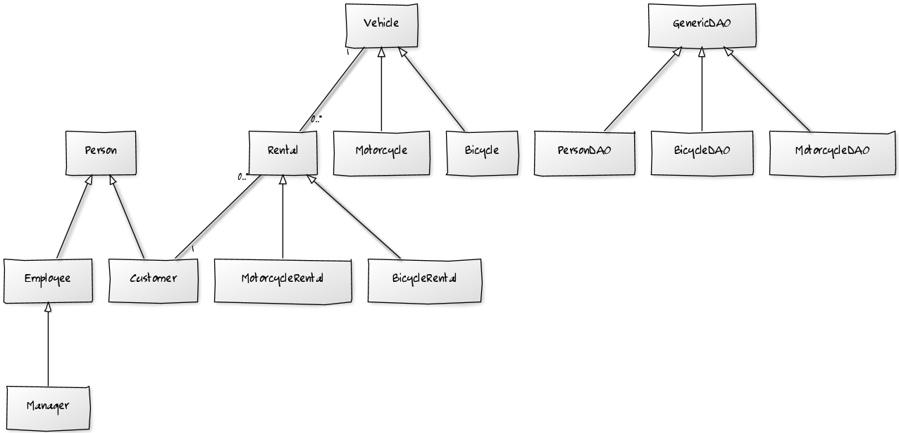
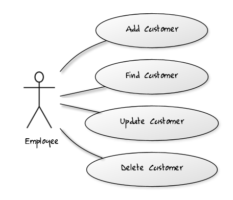
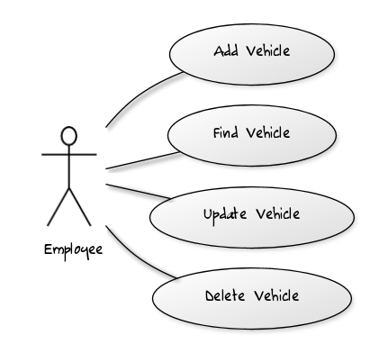
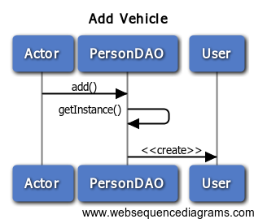

# Motobike

## Compilação

Para criar e compilar foi utilizado NetBeans IDE 7.4 para Windows, com Java 1.7.

Diretório: code/Motobike

##Documentação e diagrmas

### Diagramas de Classe

### Casos de Uso

#### Gestão de Usuários

#### Gestão de Vehículos

### Diagramas de Sequência

#### Adicionar Vehículo

#### Procurar Vehículo

#### Atualizar Vehículo

#### Excluir Vehículo

#### Scripts Geradores

A documentação UML foi feita com arquivos script individuais contendo código declarativo de diagramas. Estes podem ser encontrados a partir do diretório uml.

Diagramas de classe podem ser encontrados em uml/class, e os scripts com os Use Cases em uml/use_cases, em linguagem do yuml.me. Eles são interpretados por um utilitário que interfaceia com o site yuml.me, que é nosso engine gerador.

Os Diagramas de Sequência podem ser encontrados em uml/sequence. Estes foram gerados usando www.websequencediagrams.com. 

Uma cópia da imagem gerada de cada script pode ser encontrada em uml/_____/images, que são as imagens mostradas neste documento README.md.
